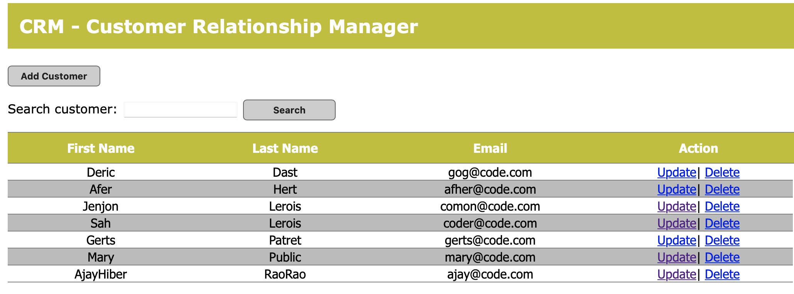
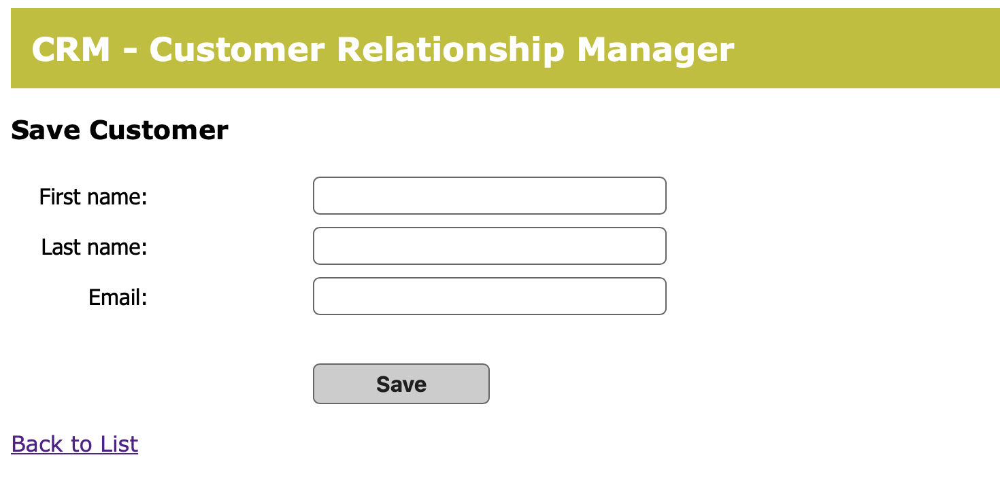

# Spring Web Project 

 Worked on the creation of a web CRM program that accepts new users and records their data in our database. 
 On the working page, we have the opportunity to see all existing users, we can also add new users using a separate button. In the table we have two active buttons Update and Delete. We can also search for users by name.

 Briefly about the project, it was created without the help of Maven, used XML files for configurations. JSP-JSTL are used. We use Hibernate (SessionFactory) to connect to the database. Our program is synchronized with the MySQL database.
There is also an Aspect that shows us which methods we use, and which arguments we accept, and which results we return.

 When filling out the form, we store the following data:
- First name;
- Last name;
- Email.

